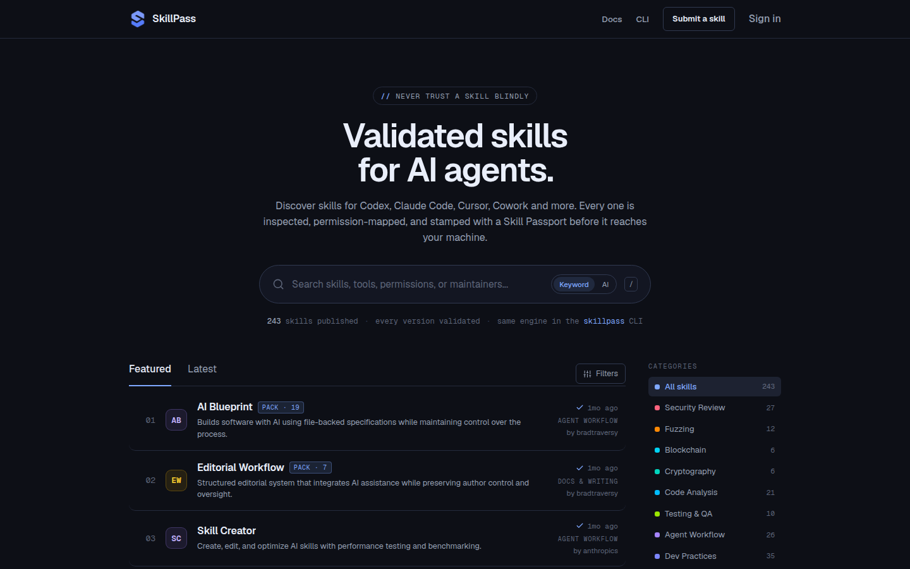
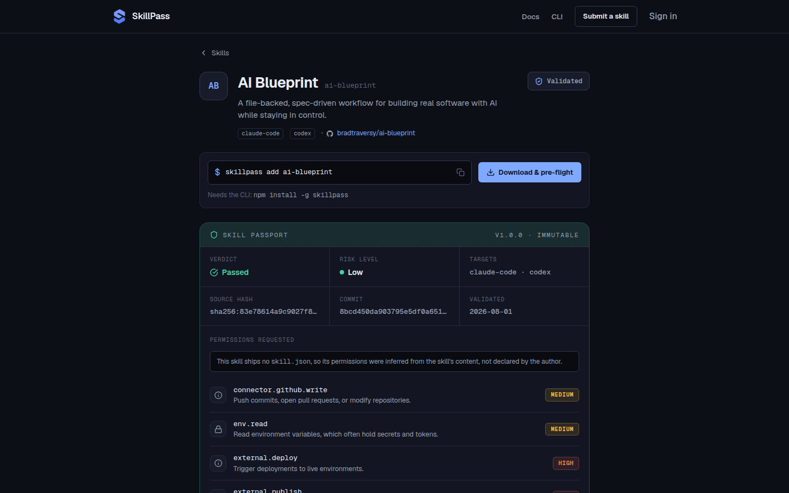

# SkillPass

[](https://github.com/bradtraversy/skillpass/actions/workflows/verify.yml)
[](https://www.npmjs.com/package/skillpass)
[](LICENSE)

A public, validation-first directory of AI agent skills: discover a skill, see
which tools it targets, and inspect exactly what it asks an agent to do before
you install it.

**Core rule: never blindly trust a skill.**

Live at [skillpass.dev](https://skillpass.dev). The `skillpass` CLI is
[on npm](https://www.npmjs.com/package/skillpass).



## Why

AI agent skills (reusable instructions for Codex, Claude Code, Cursor, Cowork,
Aider, and similar tools) are becoming real software artifacts, but they're
scattered across repos, gists, and dotfiles with no way to know what one
actually does to your machine before you install it. A skill can tell an agent
to read files, run shell commands, or send data over the network.

This directory pairs discovery with built-in validation. Every listed skill is
scanned, and every version gets a **Skill Passport**: a public, immutable report
of its status (passed / warning / failed), risk level, declared vs detected
permissions, findings, and an AI-written account of what the skill does. The
same scanner ships as a CLI, so you can verify any skill yourself instead of
trusting the website.

## How it works

1. **Pin.** A submitted repository resolves to an exact commit. A moving branch
   is never trusted.
2. **Snapshot.** The files are captured to storage under a source hash.
3. **Validate.** The snapshot is parsed and scanned: manifest and skill files,
   permission detection, rules for leaked secrets, prompt injection, and
   dangerous commands, then an AI review of the instructions themselves.
4. **Publish immutably.** A passing version publishes with its passport. The
   passport never changes; a new version gets a new one, and permission changes
   between versions are diffed.
5. **Verify at install.** Downloads and the CLI re-check the bytes against the
   pinned source hash, so what you install is exactly what was reviewed.

Validation is advisory, not gatekeeping. Only a leaked secret value or an
unreadable package hard-fails; everything else becomes a finding on the
passport, and the judgment stays with you.



## What's live

- **Directory**: keyword search and AI semantic search, category and
  works-with filters, curated Featured and Latest tabs, multi-skill workflow
  packs
- **Skill pages**: the Skill Passport, declared vs detected permissions, the AI
  review, a source view pinned to the validated hash, version history with
  permission diffs, and an install panel
- **Submissions**: a GitHub URL (single skill, a folder inside a bigger repo, or
  a pack) or a zip upload, an ownership rule against impersonation, live
  validation progress, and one-click publish
- **Download pre-flight**: the current passport, permission diff, and a block
  on failed versions before any bytes are served
- **CLI**: `search`, `scan`, `report`, `add`, `update`, `remove`, `outdated`,
  and `list`, with hash-verified atomic installs into Claude Code, Codex, or
  any folder
- **Accounts**: GitHub sign-in, maintainer dashboard, public profiles,
  reputation, abuse reports, and an admin review queue

The [website docs](https://skillpass.dev/docs) cover the passport, validation
and the permission taxonomy, submitting, and the CLI in detail.

## Quick start with the CLI

```
npm install -g skillpass
skillpass search pdf                       # find skills in the directory
skillpass report pdf                       # read the passport before installing
skillpass add pdf --target claude-code     # verified install into .claude/skills
skillpass scan ./my-skill                  # run the validator on your own skill
```

Node 20 or newer, zero runtime dependencies. See
[packages/cli/README.md](packages/cli/README.md) for every command and flag.

## Layout

pnpm monorepo:

| Path | What it is |
| --- | --- |
| `apps/web` | Astro front end: static pages plus on-demand skill and profile pages, React islands for interactivity |
| `apps/api` | Node API (Hono): GitHub OAuth, submissions, validation, publishing, AI review, search |
| `packages/skill-schema` | Shared Zod schemas: manifest, report, passport, permission taxonomy |
| `packages/validator` | The scan engine ("Skill Authenticator") + fixture packages |
| `packages/cli` | The `skillpass` CLI: scan, report, search, add, update, remove, outdated, list |

## Architecture

- **Web**: Astro with the Node adapter. Directory and docs pages are static;
  skill and profile pages render on demand so a new publish appears without a
  rebuild. React islands call the API for anything live.
- **API**: Hono on Node. Neon Postgres through Drizzle, Cloudflare R2 for
  uploaded zips and normalized source snapshots, GitHub OAuth for sign-in.
- **Validation**: runs inline in the API by default. A BullMQ + Redis worker
  mode is retained for scaling out (`VALIDATION_MODE=queue`).
- **AI, optional**: Anthropic for the passport review, category and
  integration classification, and display copy; Voyage embeddings in pgvector
  for AI search. Without the keys those steps no-op and publishing proceeds.

## Development

Requires Node >= 22.12 and pnpm 11 (`corepack enable`).

```
pnpm install         # also wires the pre-push hook
pnpm dev             # web at http://localhost:4321
pnpm dev:api         # API at http://localhost:8787; copy apps/api/.env.example to apps/api/.env first
pnpm verify          # lint, format check, typecheck, tests, build: what the hook and CI run
pnpm test            # Vitest across the monorepo
pnpm lint            # ESLint; pnpm format writes Prettier's formatting
pnpm cli search pdf  # run the CLI from source
```

Set `SKILLPASS_API=http://localhost:8787` to point the CLI at the local API.
`AGENTS.md` lists every command and the conventions the codebase follows.

## Deploy

`render.yaml` defines two Render services, the web app and the API, with Neon
and R2 as external services. Secrets are set in the Render dashboard, never in
the file. The API runs migrations before each deploy and exposes `/health`.

## License

[MIT](LICENSE).

## Built with the AI Coding Blueprint

This project is developed with the [AI Coding Blueprint](https://github.com/bradtraversy/ai-blueprint),
a spec-first, review-gated workflow for building with AI assistants. The
workflow docs live in [blueprint/README.md](blueprint/README.md); build history
is in `blueprint/history/`.
